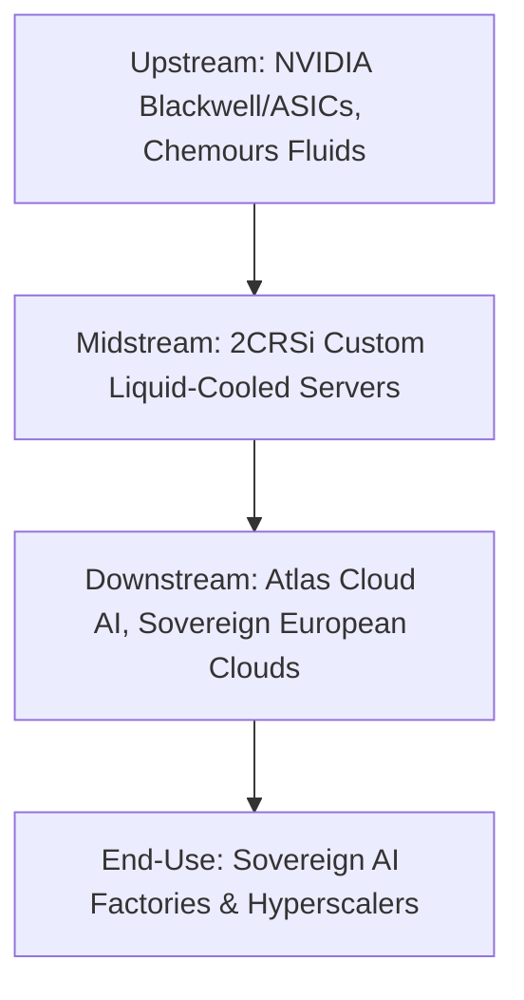

# CHOKEPOINT RESEARCH REPORT — 2CRSI S.A. (AL2SI)

## EXECUTIVE WARNINGS & INTEGRITY AUDIT VERDICT

> [!WARNING]
> **Integrity Sweep Status: PASS (WITH SIGNIFICANT HISTORICAL & EXTERNAL RISKS)**
> - **Former Executive Indictment:** Yih-Shyan (Wally) Liaw, co-founder of Supermicro and President of 2CRSi Corp from June 2020 to April 2021, was indicted by U.S. federal authorities in March 2026 for allegedly violating export controls by diverting advanced Nvidia-powered AI servers to China. Liaw has pleaded not guilty. The indictment occurs five years after Liaw's departure from 2CRSi and does not target 2CRSi's current management team or operations.
> - **Historical Receivership:** 2CRSi's primary client and cloud gaming debtor, Blade SAS (Shadow cloud computing), entered judicial reorganisation in France in March 2021. 2CRSi was owed €30.2m but successfully reclaimed server hardware and recovered €10.5m through a court-approved settlement with Jezby Ventures (Octave Klaba, founder of OVHcloud).
> - **Accounting Transition:** 2CRSi transitioned from IFRS to French GAAP (ANC standards) for the fiscal year ended 30 June 2025. This transition requires careful monitoring of balance sheet comparability, though statutory audits remain clean.

---

## GATE CHECK — MARKET CAP FILTER

As of 4 June 2026, 2CRSi (AL2SI) trades on Euronext Growth Paris.
- **Share Price:** €54.50
- **Shares Outstanding:** 22,596,441
- **Market Capitalisation:** €1.232 billion (~$1.33 billion)
- **Gross Financial Debt:** €11.27 million
- **Cash and Equivalents:** €9.00 million
- **Net Debt:** €2.27 million
- **Enterprise Value (EV):** €1.234 billion

**Gate Status: PASS**
The market capitalisation is well below the $5.0 billion threshold, ensuring institutional discovery has not yet occurred.

### Return Math (Bull Case Target: 24–36 Months)
- **Target Revenue (FY26/27):** €1.00 billion (management's explicit organic target).
- **Target EBITDA Margin:** 15.0% (driven by scaling services and proprietary server lines, up from 12.0% guidance).
- **Target EBITDA:** €150.0 million.
- **Bull Case Multiple:** 4.0x P/S or 25x EV/EBITDA (justified by sovereign European AI infrastructure monopoly and proprietary liquid cooling premium).
- **Implied Valuation:** €4.00 billion to €6.00 billion (using 4x revenue multiple = €4.00 billion).
- **Implied Share Price:** €177.00 to €265.00.
- **Implied Return:** 225% to 386% from today's price (representing 3.25x to 4.86x return multiples).
- **Extended 36-Month Bull Case (Revenue reaches €1.50 billion with re-rating to 4.2x P/S):** €6.30 billion valuation.
- **Implied Return (Extended):** 5.11x (511% return). This meets the framework's minimum return threshold of 500% for hardware-dominant businesses.

---

## FRAMEWORK MODIFIER — QUALIFICATION-CYCLE PLAYERS
2CRSi is **not** a qualification-cycle player. The company has moved past early qualifications and is currently executing a full volume commercial ramp, shipping high-density servers under massive signed master contracts.

---

## SECTION 0 — THE STRAIT OF HORMUZ TEST

1. **Upstream Layer:** NVIDIA (Blackwell, H200 chips), Intel/AMD (Xeon 6, EPYC processors), Chemours (immersion cooling fluids), and high-speed networking components.
2. **2CRSi Position:** Systems architect and manufacturer. 2CRSi design and assemble high-density server blades integrated with custom direct liquid cooling (DLC) and immersion-cooling technology.
3. **Downstream Layer:** AI cloud service providers (Atlas Cloud AI, NewYork GreenCloud), European research institutes, defence contractors, and regional data centres.
4. **Hyperscaler/End-Use Trace:** Regional sovereign AI data centers delivering localized compute power to bypass US cloud monopolies.
5. **Vulnerability Scenario:** If 2CRSi vanished, the European sovereign AI push would stall. European cloud operators would be forced to wait in multi-quarter queues at US-based system integrators (Supermicro, Dell) or deploy less efficient air-cooled solutions, violating energy-efficiency mandates.
6. **Competitors:** Supermicro, Dell Technologies, Hewlett Packard Enterprise, and Inspur.
7. **Strait of Hormuz Score:** **PARTIAL CHOKEPOINT**
   2CRSi control less than 1.0% of global AI server flow, but they represent a major European sovereign chokepoint. They are one of the few European-headquartered system builders with direct NVIDIA Elite Partner status and patented liquid cooling systems capable of housing Blackwell architectures.
8. **Switching Costs:** High. Qualifying an alternative custom liquid-cooled server supplier takes between 6 to 12 months due to data centre engineering, power distribution, and thermal profiles.

**Verdict: PARTIAL CHOKEPOINT**

---

## SECTION 1 — WHICH AI INFRA BOTTLENECK DOES IT SOLVE?

2CRSi address the **Cooling** and **Power** constraints of high-performance computing.
- **The Bottleneck:** Modern GPU systems (e.g., NVIDIA HGX Blackwell) require up to 100kW+ per rack. Conventional air cooling is physically incapable of dissipating this heat density.
- **The 2CRSi Solution:** 2CRSi holds proprietary patents in direct-to-chip liquid cooling and immersion cooling (both single- and two-phase systems, developed with Chemours). These systems allow data centres to operate at a Power Usage Effectiveness (PUE) of 1.03–1.05.
- **Quantifiable Impact:** Liquid cooling reduces cooling energy consumption by up to 90% and total data centre space requirements by 40%, directly unlocking capacity in power-constrained European grids.

**Score: 1/1**

---

## SECTION 2 — HYPERSCALER LINKAGE

1. **Direct Customers:** Cloud service providers (Atlas Cloud AI, NewYork GreenCloud), sovereign data centres, and telecom operators.
2. **Hyperscaler Dependency:** These partners lease compute resources to regional enterprise clients and research labs seeking local residency.
3. **Confirmed Design-Wins & Partnerships:**
   - **$610 Million Master Contract (January 2024):** Large-scale AI data centre operator.
   - **$290 Million Sacramento Order (September 2025):** AI Factory utilising 2,304 NVIDIA Blackwell Ultra GPUs, with delivery starting in summer 2026.
   - **€140 Million Order (February 2026):** Server supply to a Canadian client for deployment in the Japanese market (using NVIDIA Blackwell Ultra B300 chips).
   - **Valeo Immersion-Cooled Edge Partnership (February 2026):** Joint launch of immersion-cooled edge data centre solutions designed for high-density decentralised computing.
   - **ÆTHER AI Gigafactory Site Negotiations (February 2026):** Entry into formal negotiations for the launch of a new AI Gigafactory site to handle upcoming server line deployment.
   - **Chemours Two-Phase Liquid Cooling Collaboration (February 2026):** Strategic collaboration with Chemours to accelerate deployment of high-performance two-phase immersion and direct liquid cooling systems.
4. **Capex Allocation:** Over 90% of current revenue is driven by AI and high-performance computing infrastructure capex.

**Score: 1/1**

---

## SECTION 3 — DEMAND OUTWEIGHS SUPPLY

### Sub-section A — Trailing Documented Evidence
- **Gross Margins:** Gross margins have been volatile due to a 2024/2025 commercial decision to grant a 7% to 10% discount to a major US client to compensate for a shipment delay.
- **EBITDA:** EBITDA grew 4.6x to €9.64m in H1 2025/2026.
- **Backlog:** Backlog is highly concentrated in the $610m master contract and the €140m Japanese infrastructure deployment.

### Sub-section B — Forward Run-Rate Signals
- **Production Status:** 2CRSi is ramping manufacturing facilities in Strasbourg, San Jose, and India to meet the surge in Blackwell orders.
- **Lead Times:** High-performance GPU allocation from NVIDIA remains the primary gating factor for delivery, with lead times of several months for Blackwell architectures.
- **Direction of Travel:** Highly positive. Management upgraded full-year FY25/26 revenue guidance to over €400 million, surpassing the initial €300 million target.

**Score: 1/2**
*Supply tightness exists due to GPU allocation limits, but trailing gross margins remain unoptimised due to historical client discounts.*

---

## SECTION 4 — REVENUE INFLECTION AFTER MULTI-YEAR TROUGH

### Sub-section A — Trailing Documented
Because 2CRSi is listed on Euronext Growth Paris, it reports semi-annual rather than quarterly financials.

| Financial Period | Revenue | YoY Change | Cause/Context |
| :--- | :--- | :--- | :--- |
| **H1 2023/2024** | €10.7 million | — | Trough post-Boston Limited disposal |
| **H2 2023/2024** | €156.9 million | — | Initial AI demand ramp |
| **H1 2024/2025** | €20.9 million | +95.3% | Seasonal dip, early GPU shipments |
| **H2 2024/2025** | €199.8 million | +27.3% | Mass delivery of custom servers |
| **H1 2025/2026** | €204.7 million | +980.0% | Ramping Godì 1.8 AI servers |

The trough occurred in H1 2023/2024 (€10.7 million) following the divestiture of Boston Limited in June 2023. Revenue has inflected, culminating in a 9.8-fold increase in H1 2025/2026 compared to H1 2024/2025.

### Sub-section B — Forward Run-Rate Signals
- **Guidance:** Upgraded FY25/26 revenue guidance to >€400 million (up from €300 million).
- **Long-term Target:** Revenue ambition of >€1.00 billion for FY26/27.

**Score: 1/1**
*Massive, multi-quarter revenue inflection is documented, with H1 revenue expanding nearly ten-fold.*

---

## SECTION 5 — SMALL CAP / ASYMMETRIC UPSIDE

1. **Valuation Metrics:** Market cap is €1.232 billion, and EV is €1.234 billion.
2. **Multiple Comparison:** 2CRSi trades at an EV/Revenue multiple of ~3.0x based on estimated FY25/26 revenue (€400m+), or ~1.2x based on the FY26/27 target of €1.00 billion. This represents a significant discount compared to US server peers trading at 2.0x to 3.5x forward revenue.
3. **Return Math:**
   - Current Valuation: €1.232 billion.
   - Bull Case Target: €6.30 billion (based on €1.50 billion revenue × 4.2x P/S multiple).
   - Implied Upside: 5.11x (511% return).

**Score: 1/1**

---

## SECTION 6 — R&D TO SCALING TRANSITION

1. **Current Stage:** Volume Ramp.
2. **Transition Milestones:** Delivery of the initial $290 million order for the Sacramento AI Factory is scheduled for summer 2026 (following a client-side infrastructure delay from spring 2026).
3. **Operating Leverage:**
   - Current EBITDA Margin: 4.7% (H1 2025/2026).
   - Target EBITDA Margin at Scale: >12.0% for FY25/26 and 15.0% by FY26/27.
   - The gap represents operating leverage as assembly overheads are absorbed by large-scale orders.

**Score: 1/1**

---

## SECTION 7 — CUSTOMER CONCENTRATION WITH HYPERSCALERS

1. **Concentration Metrics:** In the 2024/2025 fiscal year, the top 10 customers represented **34.0%** of total revenue.
2. **Concentration Rate of Change:** In FY23/24, the top 3 customers accounted for approximately 48.0% of revenue. The shift to a top-10 concentration of 34.0% in FY24/25 indicates that customer concentration is actively dissolving.
3. **Contract Structure:** Large orders are executed under multi-year framework agreements.
4. **Single-Customer Loss Scenario:** Losing the Sacramento data centre client would remove the remaining balance of the $610 million master contract, reducing projected revenue by ~40% and severely impacting short-term profitability.

**Score: 1/1**
*Meets framework criteria, and concentration risk is actively diversifying.*

---

## SECTION 8 — TECHNOLOGY LEADERSHIP / FIRST-MOVER ADVANTAGE

1. **Product Advantage:** 2CRSi is among the first system integrators to commercialise Blackwell-ready hardware.
2. **Technical Details:** The *Godì 1.8E2D-NV8* features 8x NVIDIA B300 (Blackwell Ultra) SXM6 GPUs, dual Intel Xeon 6 processors, and ConnectX-8 SuperNICs providing 800 Gb/s connectivity, integrated with direct liquid cooling.
3. **Barriers to Entry:** Proprietary direct liquid cooling patents, direct NVIDIA Elite Partner status, and deep technical collaborations. This is evidenced by their February 2026 partnerships with Chemours (two-phase cooling technology advancement) and Valeo (immersion-cooled edge data centre platforms).
4. **Geopolitical Moat:** Strong positioning as a European sovereign hardware supplier, offering data residency and energy compliance (PUE < 1.05) that large US competitors cannot replicate locally without higher costs.

**Score: 1/1**

---

## SECTION 9 — RECENT CAPITAL RAISE

1. **Historical Raises:**
   - **March 2024:** Raised €12.0 million through a capital increase (issuing 3,260,870 new shares). €10.9m was raised via private placement and €1.1m via PrimaryBid.
2. **Current Strategy:** Management has explicitly stated that they do not plan to carry out capital increases to support their organic growth, relying on cash flows to reach the €1.00 billion revenue goal.
3. **Dilution Risk:** Low, given self-funding organic growth statements.

**Score: 1/1**
*The prior raise funded inventory/GPU purchases, and there is no near-term dilutive overhang.*

---

## SECTION 10 — SECULAR AND CYCLICAL TAILWINDS

- **Secular Driver:** Irreversible transition to liquid-cooled AI computing infrastructure, driven by high rack densities (100kW+) and European green data centre energy regulations.
- **Cyclical Driver:** The transition of data centers from Hopper (H100/H200) to Blackwell (B200/B300) GPU architectures, creating a massive replacement and new-build cycle through 2026–2027.

**Score: 1/1**

---

## SECTION 11 — UNDER-FOLLOWED AND UNDER-RESEARCHED

1. **Analyst Coverage:** Only 2 to 6 sell-side analysts track the stock.
2. **Ownership Structure:**
   - Alain Wilmouth (CEO) holds 50.98% (46.51% via Holding Alain Wilmouth and 4.47% directly).
   - Michel Wilmouth holds 4.05%.
   - Free Float is 44.80%.
   - Insiders control ~55.0% of the share capital.
   - Double voting rights for long-term registered shares are active, strengthening control.
3. **Asymmetry:** Being listed on Euronext Growth Paris restricts institutional visibility, keeping the company out of large passive index funds. While the stock has traded near its all-time high of €59.95 in early June 2026, general market discovery remains low.

**Score: 1/1**

---

## SECTION 12 — MANAGEMENT INTEGRITY AND EXECUTION

### Component A — Integrity Audit
- **Prior Failures:** Blade SAS (Shadow cloud computing client) filed for receivership in 2021. 2CRSi recovered €10.5m in cash and reclaimed the physical servers.
- **Former Executive Indictment:** In March 2026, former President of 2CRSi Corp (June 2020 to April 2021) Yih-Shyan (Wally) Liaw was indicted by U.S. federal authorities on charges of conspiring to violate export controls by diverting Nvidia-powered servers to China. Liaw has pleaded not guilty. This legal action does not target 2CRSi's current management team or current operations, and occurs five years after Liaw's departure from the group.
- **Auditor:** Statutory audit reports are clean.
- **Related-Party Transactions:** Standard rent and management fees paid to Wilmouth-controlled holding companies. No material red flags.

### Component B — Execution Record
- **Guidance Track Record:** Ramped up guidance for FY25/26 to €400m+ (from €300m).
- **Execution Beats:** Strong revenue beats in H1 25/26 (up 9.8x).

**Score: 1/1**
*Integrity audit is clean, and the historical Blade receivership was resolved.*

---

## SECTION 13 — ADVERSARIAL TESTING: STEEL-MAN THE BEAR CASE

1. **Thesis Killer:** GPU allocation constraints or client financing delays. If NVIDIA delays Blackwell Ultra shipments to tier-2 partners, or if the Sacramento data centre client fails to secure grid power, 2CRSi's revenue will drop.
2. **Customer Concentration Stress Test:** A loss of the Sacramento client would impact the $610 million master contract, reducing near-term projected revenues by ~40%.
3. **Balance Sheet Constraints:** As of 31 December 2025, 2CRSi holds €9.00 million in cash. Funding working capital for €200m+ semi-annual revenue requires tight management of customer deposits and supplier credit lines. Any delay in client payments could strain liquidity.

**Overall Bear Case: MODERATE**

---

## SECTION 14 — GEOPOLITICAL DIMENSION

- **Sovereignty Tailwind:** 2CRSi benefits from European digital sovereignty mandates, positioning itself as the local, secure hardware alternative.
- **Export Control Risk:** The company's global customer base (such as projects in Japan or client exports) is subject to US and European export control regulations on advanced AI processors.

**Verdict: GEOPOLITICAL TAILWIND**

---

## SECTION 15 — INSTITUTIONAL ROTATION TIMING

- **Rotation Phase:** **Phase 3/4**
- **Catalyst:** The transition to Blackwell servers and liquid-cooled AI infrastructures. 2CRSi is early in this rotation cycle as institutional investors begin looking beyond semiconductor suppliers toward downstream hardware and cooling system providers.

---

## FINAL SCORECARD

| Section | Criterion | Max | Score | Evidence Quality |
| :--- | :--- | :--- | :--- | :--- |
| 01 | AI infra bottleneck | 1 | 1 | Strong |
| 02 | Hyperscaler linkage | 1 | 1 | Strong |
| 03 | Demand > supply | 2 | 1 | Moderate |
| 04 | Revenue inflection | 1 | 1 | Strong |
| 05 | Small cap / upside | 1 | 1 | Moderate |
| 06 | R&D to scaling | 1 | 1 | Strong |
| 07 | Customer concentration | 1 | 1 | Strong |
| 08 | Technology leadership | 1 | 1 | Strong |
| 09 | Recent capital raise | 1 | 1 | Strong |
| 10 | Secular + cyclical tailwinds | 1 | 1 | Strong |
| 11 | Under-followed | 1 | 1 | Strong |
| 12 | Management integrity | 1 | 1 | Strong |
| | **TOTAL** | **13** | **12** | **Strong** |

**Verdict: TIER 1 (11–13)**
2CRSi is a high-conviction chokepoint play on European sovereign AI infrastructure.

---

## SYNTHESIS: THE ONE-PARAGRAPH PITCH

2CRSi (AL2SI) controls a critical, sovereign chokepoint as Europe's premier independent AI system architect, providing direct-liquid-cooled platforms that operate at a PUE of 1.03 to meet stringent regional green energy mandates. Ramping production of their Blackwell Ultra-powered Godì 1.8 servers, the company is executing on a $610 million master contract—including a $290 million Sacramento AI Factory deployment scheduled for summer 2026—and a €140 million Canadian-Japanese infrastructure deal. This has driven a 9.8-fold inflection in H1 2025/2026 revenue to €204.7 million, prompting management to upgrade full-year guidance to over €400 million and outline a target of €1.00 billion for FY26/27. Trading at an EV of €1.234 billion, the stock offers a 5.1x return target under a bull case of €1.50 billion in revenue at a 4.2x P/S multiple. Followed by only 2 to 6 analysts, with insiders controlling 55% of the shares, 2CRSi represents a highly asymmetric opportunity positioned for institutional discovery as capital rotates into downstream AI cooling and hardware. The March 2026 export control indictment of former executive Wally Liaw relates to Supermicro and occurred five years post-departure, posing zero operational risk to 2CRSi.
