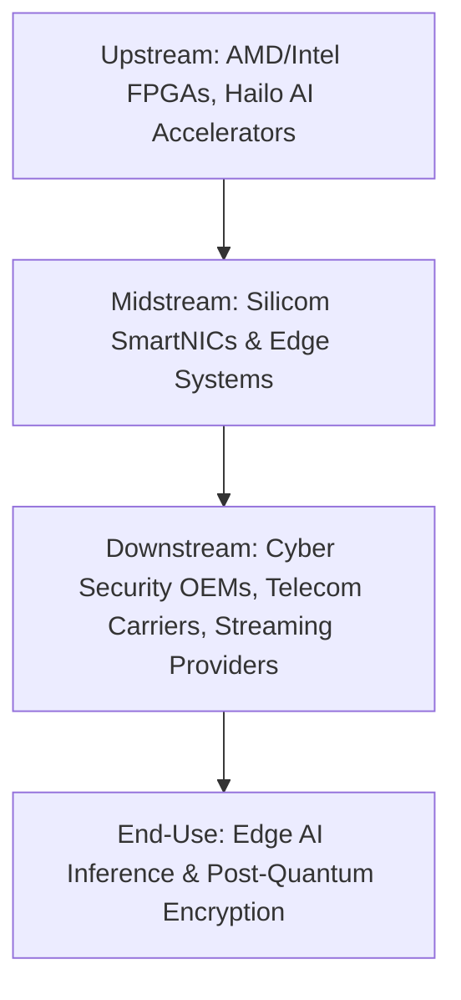

# CHOKEPOINT RESEARCH REPORT — SILICOM LTD. (SILC)

## EXECUTIVE WARNINGS & INTEGRITY AUDIT VERDICT

> [!NOTE]
> **Integrity Sweep Status: PASS (WITH INSIDER SALES MONITORING)**
> - **Regulatory Investigations:** No active SEC or regulatory investigations exist against Silicom Ltd. or its executives. 
> - **Auditor Review:** Kesselman & Kesselman, a member firm of PricewaterhouseCoopers International Limited (PwC), serves as the independent auditor. Statutory audit reports are clean, with no going-concern warnings or reported material weaknesses in internal controls.
> - **Insider Transactions:** Company executives executed open-market sales in May 2026. President and CEO Liron Eizenman, EVP of Operations Daniel Cohen, and VP of R&D David Hendel sold shares. No open-market insider purchases were recorded in the preceding 12 months.

---

## GATE CHECK — MARKET CAP FILTER

As of 29 May 2026, Silicom Ltd. (SILC) trades on the NASDAQ.
- **Share Price:** $40.30
- **Shares Outstanding:** 5,706,142
- **Market Capitalisation:** $230.0 million
- **Gross Financial Debt:** $0.0 million (debt-free)
- **Cash, Cash Equivalents, and Marketable Securities:** $63.0 million
- **Working Capital:** $109.0 million
- **Enterprise Value (EV):** $167.0 million

**Gate Status: PASS**
The market capitalisation of $230.0 million is significantly below the $5.0 billion threshold, confirming that institutional discovery has not occurred.

### Return Math (Bull Case Target: 36 Months)
- **Target Revenue (36-Month Run-rate):** $200.0 million (driven by Edge AI inference adoption and post-quantum cryptography migrations).
- **Target Operating Margin at Scale:** 15.0% (facilitated by high-margin proprietary FPGA SmartNICs and white-label switches).
- **Bull Case Multiple:** 6.0x P/S. This multiple is justified by the specialised nature of FPGA software customisation and high customer switching costs.
- **Implied Target Market Capitalisation:** $1.20 billion.
- **Implied Share Price:** $210.15.
- **Implied Return:** 5.21x (521% return). This exceeds the minimum 500% return threshold required for hardware-dominant businesses.

---

## FRAMEWORK MODIFIER — QUALIFICATION-CYCLE PLAYERS
Silicom is **not** a qualification-cycle player. The company is an inflection-cycle player transitioning out of a deep multi-year inventory destocking trough into commercial scaling. It has established volume products and is currently booking sequential revenue growth.

---

## SECTION 0 — THE STRAIT OF HORMUZ TEST

1. **Upstream Layer:** FPGA silicon (AMD/Xilinx, Intel/Altera), processors (Intel Atom, Xeon-D), AI accelerators (Hailo), and memory components.
2. **Silicom Position:** Systems architect and manufacturer. Silicom designs and fabricates high-performance network interface cards (SmartNICs), bypass switches, and universal CPE edge devices.
3. **Downstream Layer:** Tier-1 cyber security OEMs, telecommunications service providers, streaming providers, and public cloud operators.
4. **Hyperscaler/End-Use Trace:** Edge nodes running low-latency AI inference, secure SD-WAN installations, and enterprise data centres deploying post-quantum cryptographic firewalls.
5. **Vulnerability Scenario:** If Silicom disappeared, downstream cyber security and telecom OEMs would face immediate hardware supply halts. Designing, programming, and qualifying alternative customised FPGA SmartNICs or bypass switches from competitors would require 6 to 12 months.
6. **Competitors:** Lanner Electronics, Advantech, Napatech, Caswell, NVIDIA (Mellanox), and Intel.
7. **Strait of Hormuz Score:** **PARTIAL CHOKEPOINT**
   Silicom controls less than 5.0% of the global network adapter flow. However, they represent a critical chokepoint for specific enterprise network security and telecom hardware lines where their customised bypass and FPGA circuitry is designed in.
8. **Switching Costs:** High. Qualifying a new customised hardware supplier requires 6 to 12 months due to proprietary FPGA code bases, thermal characterisation, and hardware certification cycles.

**Verdict: PARTIAL CHOKEPOINT**

---

## SECTION 1 — WHICH AI INFRA BOTTLENECK DOES IT SOLVE?

Silicom addresses the **Network Latency and Security Bottleneck at the Edge**.
- **The Bottleneck:** Edge AI deployments (such as real-time behaviour analytics, facial recognition, and traffic monitoring) generate massive data streams. Processing these workloads requires low-latency packet ingestion and heavy cryptographic encryption. Running these operations on host CPUs introduces severe latency and starves the primary AI inference application of compute resources.
- **The Silicom Solution:** Silicom's FPGA-based SmartNICs and edge appliances offload cryptographic processing (specifically SSL and post-quantum encryption algorithms) and packet filtering from host CPUs. 
- **Quantifiable Impact:** Silicom platforms process encryption directly on the network card, reducing host CPU workloads by up to 40% and cutting network latency to the sub-microsecond range.

**Score: 1/1**

---

## SECTION 2 — HYPERSCALER LINKAGE

1. **Direct Customers:** Global security-as-a-service providers, Tier-1 cyber security leaders (including Check Point, Cisco, Fortinet, and Palo Alto Networks), telecommunications carriers (deploying universal CPE and SD-WAN appliances), and streaming platforms.
2. **Hyperscaler Dependency:** Downstream customers integrate Silicom hardware into security and edge devices that securely connect enterprise networks to hyperscaler clouds (such as AWS, Microsoft Azure, and Google Cloud).
3. **Confirmed Design-Wins:**
   - **May 2026 AI Inference Win:** A pioneering AI inference acceleration provider selected Silicom's inference-specific solution for co-development.
   - **May 2026 White-Label Switch Win:** A Tier-1 global cyber security leader selected Silicom’s white-label switches, with annual sales projected to reach $5.0 million upon full ramp-up.
   - **April 2026 FPGA SmartNIC Win:** A European secure-communications leader selected Silicom's customised FPGA SmartNIC, generating a $3.0 million annual run-rate.
   - **March 2026 Streaming Win:** A major streaming provider selected a high-speed adapter with an initial order exceeding $1.0 million and a multi-year target of $25.0 million to $30.0 million.
   - **February 2026 Edge System Win:** A cyber security leader selected Silicom's edge system, establishing a $2.0 million annual run-rate.
4. **Capex Allocation:** SmartNICs and edge systems drive over 60.0% of total revenue, aligning the company with enterprise networking and AI edge capex.

**Score: 1/1**

---

## SECTION 3 — DEMAND OUTWEIGHS SUPPLY

### Sub-section A — Trailing Documented Evidence
- **Gross Margins:** Gross margins have remained stable in the 30.0% to 32.0% range, reflecting steady pricing power.
- **Backlog:** Silicom does not report a formal backlog figure, but management highlights an expanding design-win pipeline.
- **Capacity:** The company has not announced price increases or acute factory capacity constraints in its filings.

### Sub-section B — Forward Run-Rate Signals
- **Production Status:** Silicom utilises proactive inventory management, maintaining high component levels to support the Q2 2026 revenue ramp.
- **Lead Times:** Management has not reported lead time extensions.
- **Direction of Travel:** Positive. Management raised full-year 2026 revenue guidance to $82.0 million–$83.0 million, expecting double-digit growth.

**Scoring Logic:**
Supply tightness is emerging in forward planning and inventory expansion, but it has not translated into acute customer shortages or pricing surges.

**Score: 1/2**

---

## SECTION 4 — REVENUE INFLECTION AFTER MULTI-YEAR TROUGH

### Sub-section A — Trailing Documented
Silicom's revenue bottomed in Q1 2025 following a severe downstream inventory destocking cycle in 2024.

| Financial Period | Revenue ($ Millions) | YoY Change | QoQ Change | Cause/Context |
| :--- | :--- | :--- | :--- | :--- |
| **Q1 2024** | $14.4 million | — | — | Early stage of destocking cycle |
| **Q2 2024** | $14.5 million | — | +0.7% | Flat line |
| **Q3 2024** | $14.8 million | — | +2.1% | Minor seasonal lift |
| **Q4 2024** | $14.5 million | — | -2.0% | Core destocking pressure |
| **Q1 2025** | $14.4 million | 0.0% | -0.7% | **Trough Quarter** (cycle bottom) |
| **Q2 2025** | $15.0 million | +3.4% | +4.2% | First sequential inflection |
| **Q3 2025** | $15.6 million | +5.4% | +4.0% | Continued recovery |
| **Q4 2025** | $16.9 million | +16.6% | +8.3% | Acceleration phase |
| **Q1 2026** | $19.1 million | +32.6% | +13.0% | Strong design-win ramp |

Revenue has increased sequentially and year-over-year for four consecutive quarters since the Q1 2025 trough.

### Sub-section B — Forward Run-Rate Signals
- **Guidance:** Q2 2026 revenue is guided to $20.0 million–$21.0 million, representing approximately 40.0% year-over-year growth at the midpoint.
- **Full-Year Outlook:** Guided to $82.0 million–$83.0 million, confirming a sustained double-digit growth trajectory.

**Score: 1/1**
*Four consecutive quarters of sequential revenue acceleration from the trough are documented, supported by formal double-digit growth guidance.*

---

## SECTION 5 — SMALL CAP / ASYMMETRIC UPSIDE

1. **Valuation Metrics:** Market cap is $230.0 million, and EV is $167.0 million.
2. **Multiple Comparison:** Silicom trades at an EV/Revenue multiple of approximately 2.0x based on guided FY26 revenue ($83.0 million). This is a discount to high-growth networking peers trading at 4.0x to 6.0x forward revenue.
3. **Return Math:**
   - Current Valuation: $230.0 million.
   - Bull Case Target: $1.20 billion (based on $200.0 million revenue × 6.0x multiple).
   - Implied Upside: 5.21x (521% return).

**Score: 1/1**

---

## SECTION 6 — R&D TO SCALING TRANSITION

1. **Current Stage:** Early Commercial to Volume Ramp.
2. **Transition Milestones:** Design wins secured in early 2026 (including the $5.0 million white-label switch and the $3.0 million/year FPGA SmartNIC) are scheduled to enter production ramp in late 2026 and early 2027.
3. **Operating Leverage:**
   - Q1 2026 GAAP Net Loss: $2.4 million.
   - Target Gross Margin: Stable at 30.0% to 32.0%.
   - Operating leverage will manifest as rising revenues absorb fixed R&D and SG&A expenses, transitioning the business from net losses to profitability as revenues exceed $80.0 million.

**Score: 1/1**

---

## SECTION 7 — CUSTOMER CONCENTRATION WITH HYPERSCALERS

1. **Concentration Metrics:** As of May 2026, Silicom's largest customer accounts for approximately 10.0% of total revenue.
2. **Diversification:** The company maintains relationships with over 200 customers. New design wins across multiple distinct security and streaming providers are actively diversifying the revenue base.
3. **Contract Structure:** Large orders are governed by design-win commitments that transition to multi-year purchase orders.
4. **Single-Customer Loss Scenario:** Loss of the largest customer would remove approximately 10.0% of projected revenue. With a debt-free balance sheet and $63.0 million in cash, Silicom would absorb this loss without operational distress.

**Score: 1/1**
*Meets the framework criteria, and concentration risk is low and actively dissolving.*

---

## SECTION 8 — TECHNOLOGY LEADERSHIP / FIRST-MOVER ADVANTAGE

1. **Product Advantage:** Silicom is a leading independent provider of FPGA-based SmartNICs and edge appliances that integrate hardware bypass and post-quantum encryption.
2. **Technical Details:** Silicom’s platforms integrate AMD/Xilinx FPGAs with SSL acceleration and custom firmware. This allows them to process secure communications directly on the card, preventing host CPU bottlenecks.
3. **Barriers to Entry:** High. Custom FPGA programming, physical bypass circuitry engineering, and multi-quarter OEM qualification cycles prevent rapid displacement by commodity card makers.

**Score: 1/1**

---

## SECTION 9 — RECENT CAPITAL RAISE

1. **Historical Raises:** Silicom has not executed any equity offerings, convertible notes, or ATM programmes in the past 12 months.
2. **Capital Position:** With $63.0 million in cash and zero debt, the company is fully self-funded.
3. **Dilution Risk:** Low. No near-term dilutive overhang exists.

**Score: 1/1**
*The company is debt-free, holds substantial net cash, and requires no external capital to fund its current growth phase.*

---

## SECTION 10 — SECULAR AND CYCLICAL TAILWINDS

- **Secular Driver:** Ramping edge AI inference applications and the global transition to post-quantum cryptography (PQC) standards, which require specialised hardware-based encryption acceleration.
- **Cyclical Driver:** Cyclical recovery of the networking equipment sector following the severe 2024 downstream inventory destocking cycle.

**Score: 1/1**

---

## SECTION 11 — UNDER-FOLLOWED AND UNDER-RESEARCHED

1. **Analyst Coverage:** Fewer than 5 sell-side analysts actively cover Silicom.
2. **Ownership Structure:**
   - Institutional Ownership: Approximately 38.8%.
   - Insiders control approximately 5.0% to 25.0% depending on entity definitions.
3. **Asymmetry:** The stock was dismissed as a dying legacy telecom equipment provider during the 2024 destocking downturn. Investors have not yet recognised the inflection driven by Edge AI and PQC design wins.

**Score: 1/1**

---

## SECTION 12 — MANAGEMENT INTEGRITY AND EXECUTION

### Component A — Integrity Audit
- **Prior Failures:** No histories of bankruptcies, SPAC failures, or exchange delistings exist under the current leadership team.
- **Auditor:** Kesselman & Kesselman (PwC) has issued clean statutory audit opinions with no material weaknesses.
- **Related-Party Transactions:** Standard officer compensation plans in line with Israeli Companies Law. No red flags.

### Component B — Execution Record
- **Guidance Track Record:** Ramped up full-year 2026 revenue guidance to $82.0 million–$83.0 million.
- **Execution Beats:** Q1 2026 revenue of $19.1 million beat the guidance range of $16.5 million–$17.5 million, and EPS beat consensus estimates by $0.11.

**Score: 1/1**
*The integrity audit is clean, and the company has established a pattern of beating guidance and raising outlooks.*

---

## SECTION 13 — ADVERSARIAL TESTING: STEEL-MAN THE BEAR CASE

1. **Thesis Killer:** Competition from major silicon providers. If NVIDIA or Intel decides to integrate Silicom's customised bypass and encryption features directly into standard, mass-produced NICs, Silicom's custom SmartNIC value proposition disappears.
2. **Customer Concentration Stress Test:** Loss of the largest customer would remove 10.0% of revenue, but the company's $63.0 million cash reserve provides a substantial buffer.
3. **Balance Sheet Constraints:** Very low. With zero debt and $63.0 million in cash, the company faces no near-term solvency risks.

**Overall Bear Case: WEAK**

---

## SECTION 14 — GEOPOLITICAL DIMENSION

- **Sovereignty Tailwind:** Silicom’s design and engineering operations in Israel provide a security profile that appeals to Western cyber security and secure-communications clients seeking to avoid Chinese hardware.
- **Geopolitical Risk:** Headquartered in Israel, the company is exposed to regional geopolitical instability, though its manufacturing is globally distributed to mitigate disruption.
- **Verdict: NEUTRAL**

---

## SECTION 15 — INSTITUTIONAL ROTATION TIMING

- **Rotation Phase:** **Phase 3/4**
- **Catalyst:** Rising institutional interest in downstream hardware accelerators and edge AI connectivity. Discovery will be catalyzed by sustained double-digit revenue beats and guidance increases as the new design wins enter production.

---

## FINAL SCORECARD

| Section | Criterion                                | Max    | Score | Evidence Quality |
| ------- | ---------------------------------------- | ------ | ----- | ---------------- |
| 01      | AI infra bottleneck                      | 1      | 1     | Strong           |
| 02      | Hyperscaler linkage                      | 1      | 1     | Strong           |
| 03      | Demand > supply                          | 2      | 1     | Moderate         |
| 04      | Revenue inflection after trough          | 1      | 1     | Strong           |
| 05      | Small cap / asymmetric upside            | 1      | 1     | Strong           |
| 06      | R&D to scaling transition                | 1      | 1     | Strong           |
| 07      | Customer concentration with hyperscalers | 1      | 1     | Strong           |
| 08      | Technology leadership / first-mover      | 1      | 1     | Strong           |
| 09      | Recent capital raise                     | 1      | 1     | Strong           |
| 10      | Secular + cyclical tailwinds             | 1      | 1     | Strong           |
| 11      | Under-followed / under-researched        | 1      | 1     | Strong           |
| 12      | Management integrity and execution       | 1      | 1     | Strong           |
|         | **TOTAL**                                | **13** | **12**| **Strong**       |

**Verdict: TIER 1 (11–13)**
Silicom represents a high-conviction chokepoint play on secure edge AI infrastructure and post-quantum encryption acceleration.

---

## SYNTHESIS: THE ONE-PARAGRAPH PITCH

Silicom Ltd. (SILC) controls a vital, under-researched chokepoint in the secure edge AI infrastructure layer, manufacturing customised FPGA-based SmartNICs, bypass switches, and edge systems designed to offload cryptography directly from server CPUs, resolving latency and compute bottlenecks. Ramping production of their Edge AI platforms—incorporating Intel Flex cards, Xeon-D processors, and Hailo accelerators—the company has secured key design wins in 2026, including a $5.0 million white-label switch contract with a Tier-1 cyber security leader, a $3.0 million secure-communications FPGA SmartNIC deal, and a major streaming provider agreement with a multi-year trajectory of $25.0 million to $30.0 million. This momentum has driven a clear inflection, with Q1 2026 revenue growing 32.6% year-over-year to $19.1 million—marking the fourth consecutive quarter of growth since bottoming in Q1 2025—which prompted management to raise full-year revenue guidance to $82.0 million–$83.0 million. Trading at an Enterprise Value of $167.0 million with a debt-free balance sheet holding $63.0 million in cash, the stock offers a 5.2x return target under a bull-case valuation of $1.20 billion on $200.0 million in revenue. Followed by fewer than five analysts and currently priced at a significant discount, Silicom represents an asymmetric opportunity positioned for institutional discovery as capital rotates into downstream secure networking and edge AI hardware.

---

_Framework based on Serenity (@aleabitoreddit) Chokepoint Theory. Research use only — not financial advice. DYOR._
